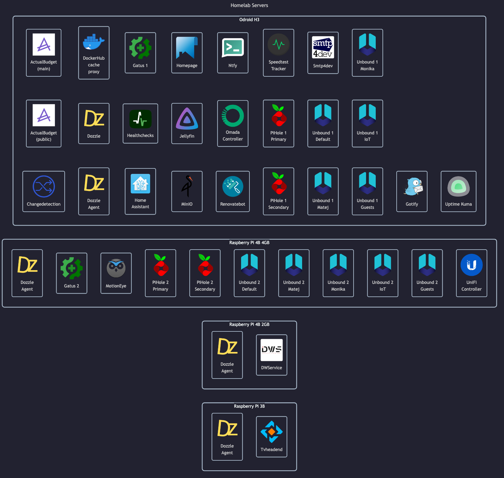

# Personal Homelab

> My personal homelab

This is my personal homelab config.
Given the nature of this project, as it applies only to me, third-party pull requests are not expected.

TL;DR:

Below is a general structure for this repository:

- `/ansible/` - Ansible playbooks for easy maintenance for multiple servers
- `/docs/` - General documentation and installation guides
- `/docker-images/` - Contains Dockerfiles for all _custom_ and _external_ docker images
    - Each _docker image_ contains reusable general config
    - Each _docker image_ can be used in 1 or more docker-apps
- `/docker-apps/` - Reusable config for individual docker-apps, eg. PiHole
    - Each _docker app_ contains reusable general config, including auxiliary services (eg. PiHole itself, Apache/Nginx reverse proxy, cron certificate loader, cron web backups, ...)
    - Each _docker app_ can be used in 1 or more docker-apps on individual servers
- `/other-apps/` - Non-Docker apps (eg. for microcontrollers)
- `/servers/` - Setup for individual physical servers

Common env variables:

- `HOMELAB_APP_TYPE` - Main app name (eg. _pihole_)
- `HOMELAB_ENV` - Current env type, either _dev_ or _prod_
- `HOMELAB_APP_EXTERNAL_DOMAIN` - Local domain alias (eg. _pihole.home_)
- `HOMELAB_HEALTHCHECK_URL` - Healthcheck URL to report CRON job status
- `HOMELAB_CONTAINER_VARIANT` - In case multiple containers of the same image are used in a single app, this differentiates between them
- Credentials:
    - `HOMELAB_APP_USERNAME` - Username (or email) for app login
    - `HOMELAB_APP_PASSWORD` - Password for app login
