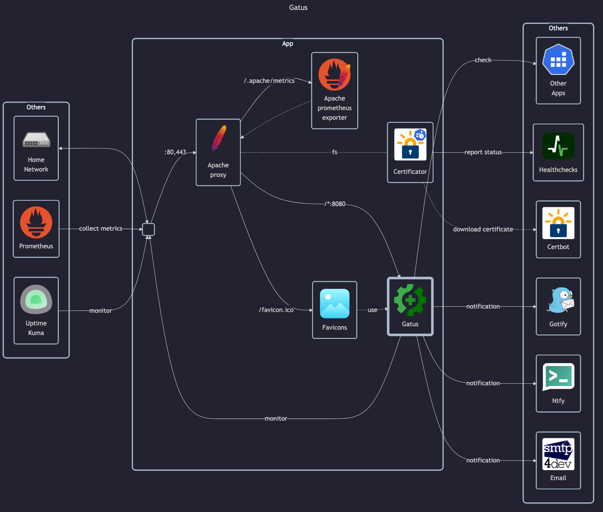

# Gatus

- GitHub: <https://github.com/TwiN/gatus?tab=readme-ov-file#docker>
- DockerHub: <https://hub.docker.com/r/twinproduction/gatus>

## Before initial installation

- \[All\] Create base secrets
- \[Prod\] Add healthchecks monitor for `certificate-manager` and configure `HOMELAB_HEALTHCHECK_URL`
- \[Prod\] Configure access tokens for some services:
  - `HOME_ASSISTANT_TOKEN`
  - `NTFY_TOKEN`

## After initial installation

Empty
