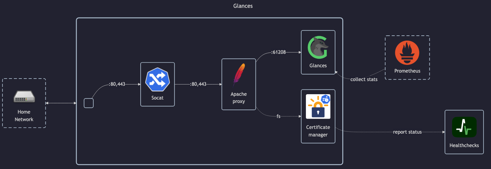

# Glances

## Docs

- GitHub: <https://github.com/nicolargo/glances>
- Homepage: <https://nicolargo.github.io/glances/>
- Dockerhub: <https://hub.docker.com/r/nicolargo/glances>
- Docs: <https://glances.readthedocs.io/en/latest/index.html>
    - Docker guide: <https://glances.readthedocs.io/en/latest/docker.html>
    - Prometheus guide: <https://glances.readthedocs.io/en/latest/gw/prometheus.html>
    - Configuration: <https://glances.readthedocs.io/en/latest/config.html>

## Before initial installation

- Follow general [guide](../../docs/Checklist%20for%20new%20docker-apps.md)

## After initial installation

Empty
