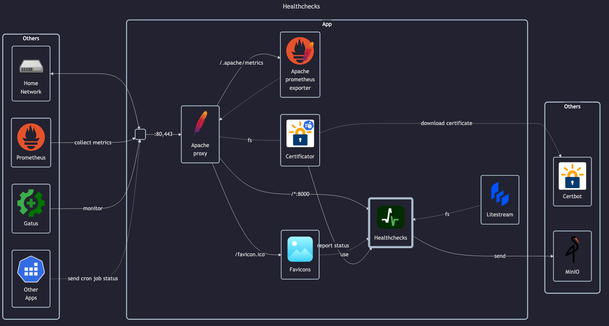

# Healthchecks.io

- GitHub: <https://github.com/healthchecks/healthchecks>
- DockerHub: <https://hub.docker.com/r/healthchecks/healthchecks>
- Docs - General: <https://healthchecks.io/docs/self_hosted_docker>
- Docs - Server configuration: <https://healthchecks.io/docs/self_hosted_configuration>
- Docs - Running in Docker: <https://healthchecks.io/docs/self_hosted_docker>

## Before initial installation

- \[All\] Create base secrets
- \[Prod\] Add healthchecks monitor for `certificate-manager` and configure `HOMELAB_HEALTHCHECK_URL`
- \[Prod\] Add healthchecks monitor for `web-backup` and configure `HOMELAB_HEALTHCHECK_URL`

## After initial installation

- \[Prod\] Setup `uptime-kuma` monitoring:
    - IP (ping) monitor
    - TCP monitor for all open ports
    - HTTP/HTTPS monitor
