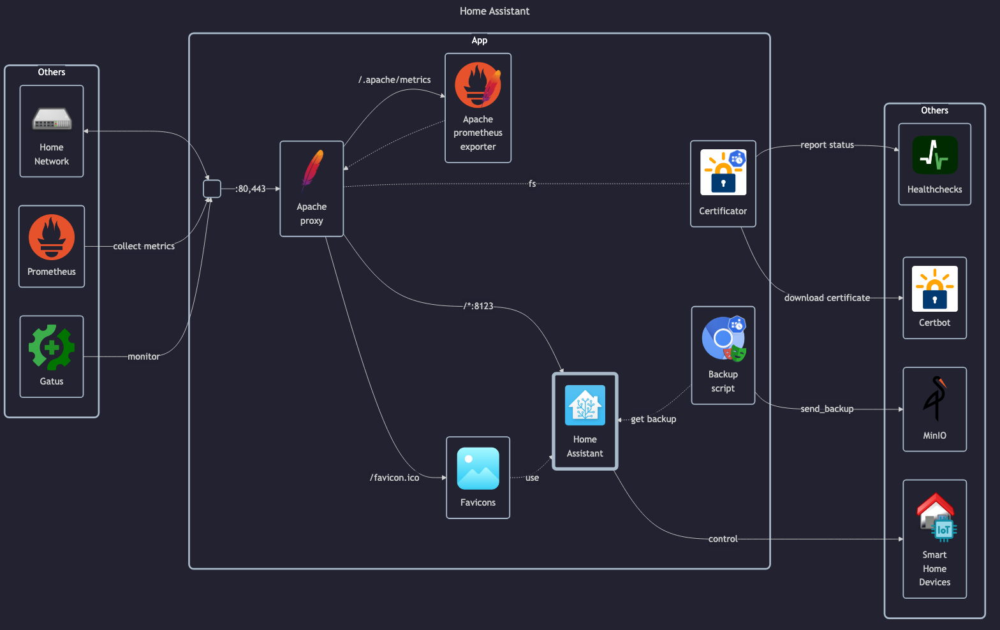

# Home Assistant

- Generic installation tutorial: <https://www.home-assistant.io/installation>
- Container installation tutorial: <https://www.home-assistant.io/installation/linux#install-home-assistant-container>
- Configuration guide: <https://www.home-assistant.io/docs/configuration>
- DockerHub: <https://hub.docker.com/r/homeassistant/home-assistant>

---

- LinuxServer docs: <https://docs.linuxserver.io/images/docker-homeassistant>
- LinuxServer DockerHub: <https://hub.docker.com/r/linuxserver/homeassistant>

## Before initial installation

- \[All\] Create base secrets

## After initial installation

- \[Prod\] Configure settings
- \[Prod\] Setup 2FA - <https://www.home-assistant.io/docs/authentication/multi-factor-auth>
- \[Prod\] Connect smart devices
