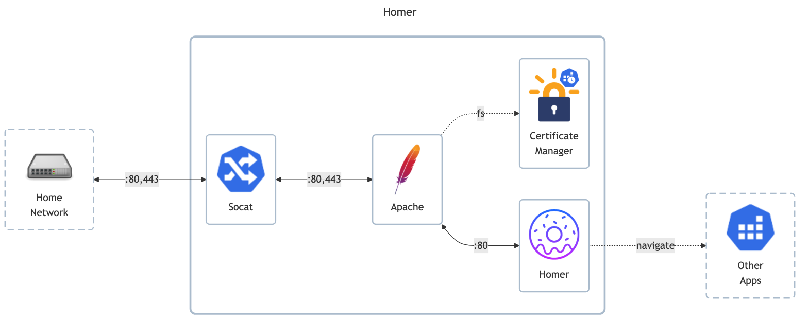

# Homer

- GitHub: <https://github.com/bastienwirtz/homer>
- DockerHub: <https://hub.docker.com/r/b4bz/homer>
- Basic configuration: <https://github.com/bastienwirtz/homer/blob/main/docs/configuration.md>
- Service types: <https://github.com/bastienwirtz/homer/blob/main/docs/customservices.md>
- Troubleshooting (CORS): <https://github.com/bastienwirtz/homer/blob/main/docs/troubleshooting.md>

## Before initial installation

- \[All\] Create base secrets
- \[Prod\] Add healthchecks monitor for `certificate-manager` and configure `HOMELAB_HEALTHCHECK_URL`

## After initial installation

- \[Prod\] Setup `uptime-kuma` monitoring:
    - IP (ping) monitor
    - TCP monitor for all open ports
    - HTTP/HTTPS monitor
