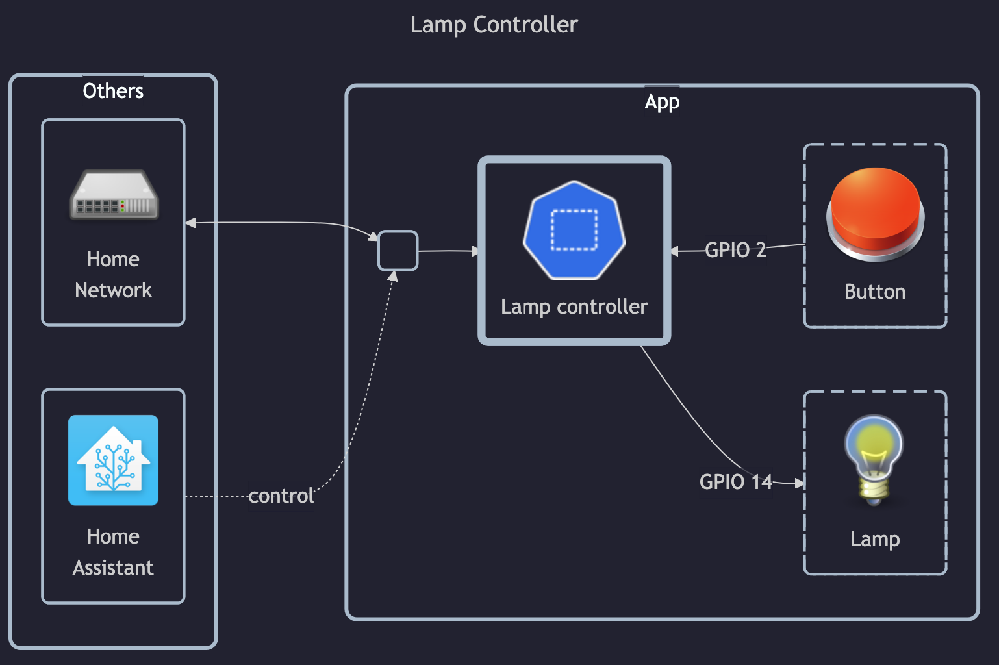

# Lamp Controller

Main documentation found at
[lamp-network-server](../../docker-images/custom/lamp-network-server/README.md)
and
[lamp-hardware-controller](../../docker-images/custom/lamp-hardware-controller/README.md).

## Before initial installation

- \[All\] Create base secrets
- \[Prod\] Add healthchecks monitor for `certificate-manager` and configure `HOMELAB_HEALTHCHECK_URL`

## After initial installation

- \[Prod\] Setup `uptime-kuma` monitoring:
    - IP (ping) monitor
    - TCP monitor for all open ports
    - HTTP/HTTPS monitor
    - HTTPS JSON query monitor for basic API operation
