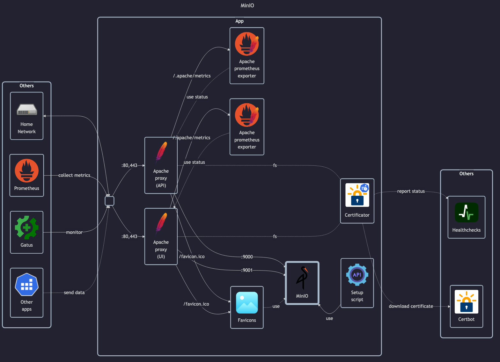

# MinIO

General (Server)

- DockerHub: <https://hub.docker.com/r/minio/minio>
- Install guide: <https://min.io/docs/minio/linux/operations/install-deploy-manage/deploy-minio-single-node-single-drive.html>
- Container guide: <https://min.io/docs/minio/container/index.html>
- Reverse proxy guide: <https://min.io/docs/minio/linux/integrations/setup-nginx-proxy-with-minio.html>

Client

- GitHub: <https://github.com/minio/mc>
- Docs: <https://min.io/docs/minio/linux/reference/minio-mc.html>
- DockerHub: <https://hub.docker.com/r/minio/mc> (unused)

## Before initial installation

- \[All\] Create base secrets
- \[Prod\] Add healthchecks monitor for `certificate-manager` and configure `HOMELAB_HEALTHCHECK_URL`

## After initial installation

- \[Prod\] Setup `uptime-kuma` monitoring:
    - IP (ping) monitor
    - TCP monitor for all open ports
    - HTTP/HTTPS monitor (API subdomain, root and healthcheck paths)
    - HTTP/HTTPS monitor (Console subdomain, root path)
    - TBD: HTTPS JSON query monitor for basic API operation?
