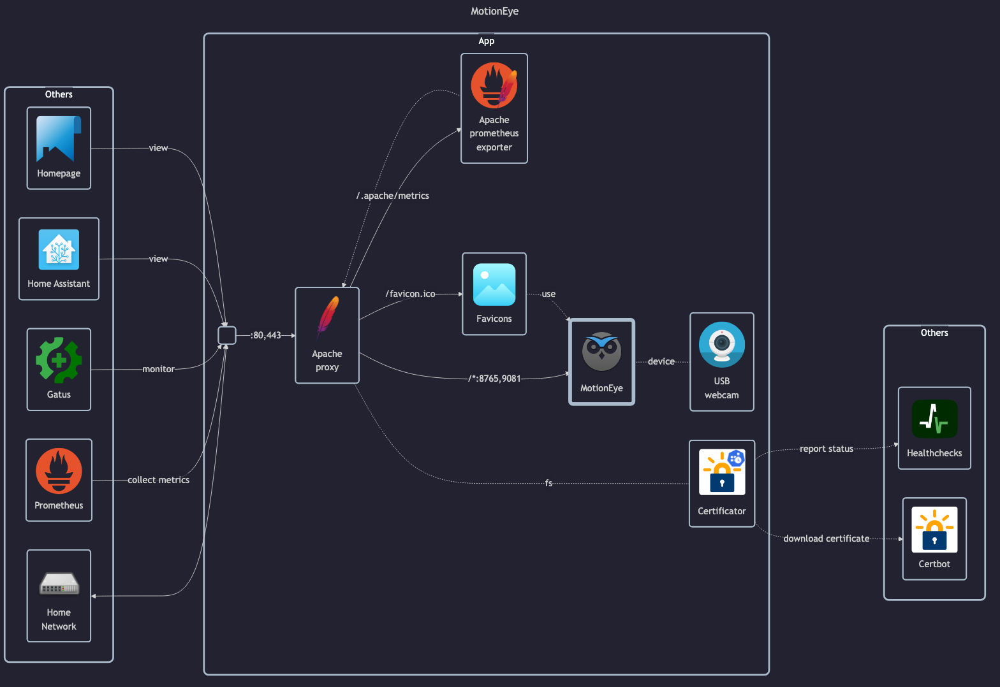

# MotionEye

MotionEye

- GitHub: <https://github.com/motioneye-project/motioneye>
    - WiKi: <https://github.com/motioneye-project/motioneye/wiki>
    - Install guide: <https://github.com/motioneye-project/motioneye/wiki/Install-In-Docker#build-instructions>
- DockerHub: N/A (only on _ghcr.io_)
- HomeAssistant plugin: <https://www.home-assistant.io/integrations/motioneye>

Motion

- Homepage: <https://motion-project.github.io>
- GitHub: <https://github.com/Motion-Project/motion>

Notes:

- Streaming only works in `user`, not in `admin`.

## Before initial installation

- \[All\] Create base secrets
- \[Prod\] Add healthchecks monitor for `certificate-manager` and configure `HOMELAB_HEALTHCHECK_URL`

## After initial installation

- \[All\] Setup `admin` and `user` passwords
