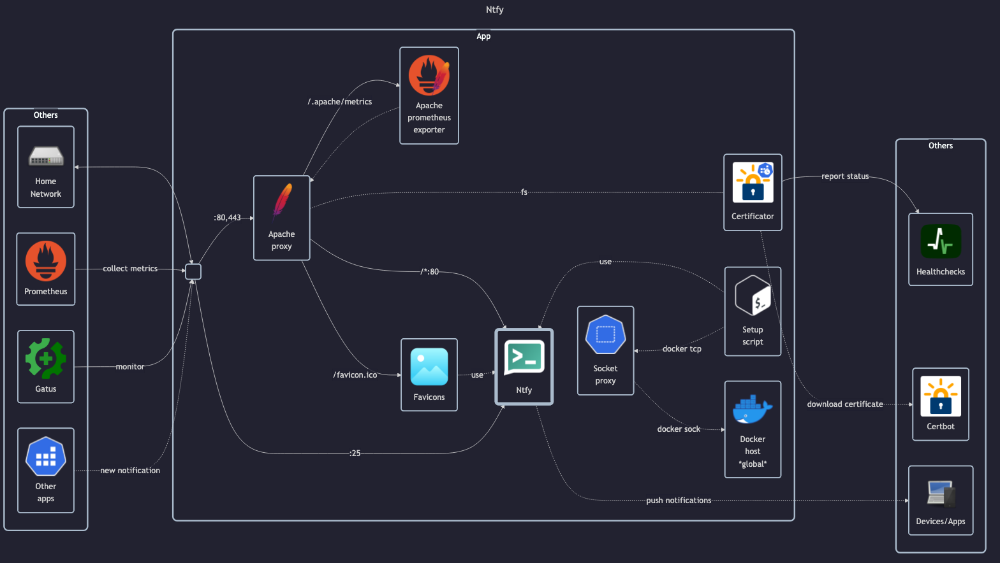

# Ntfy



## Docs

- GitHub: <https://github.com/binwiederhier/ntfy>
- DockerHub: <https://hub.docker.com/r/binwiederhier/ntfy>
- Docs: <https://docs.ntfy.sh>
- Install guide: <https://docs.ntfy.sh/install>
- Install guide - docker: <https://docs.ntfy.sh/install/#docker>

## Before initial installation

- \[All\] Create base secrets
- \[Prod\] Add healthchecks monitor for `certificate-manager` and configure `HOMELAB_HEALTHCHECK_URL`

## After initial installation

- \[Prod\] Configure basic settings
- \[Prod\] Read publisher token and save it in Vaultwarden:
    - `docker exec -it ntfy-app /bin/sh -c 'ntfy token list'`

## Publishing notifications

For publishing notifications to ntfy (see also: <https://github.com/caronc/apprise/wiki/Notify_ntfy>):

```txt
ntfy://<token>@ntfy.home/<topic>
```

Alternatively you can also publish via email (see also <https://github.com/caronc/apprise/wiki/Notify_email>):

```txt
mailto://ntfy-<topic>+<token>@ntfy.home
```

Obviously replace `<token>` and `<topic>` with their respective values (remove enclosing `<>`).
