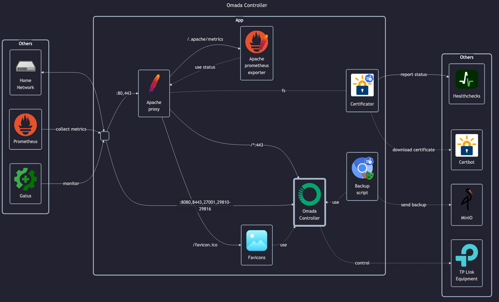

# TP-Link Omada SDN Controller

- GitHub: <https://github.com/mbentley/docker-omada-controller>
- DockerHub: <https://hub.docker.com/r/mbentley/omada-controller>

## Before initial installation

- \[All\] Create base secrets
- \[Prod\] Add healthchecks monitor for `web-backup` and configure `HOMELAB_HEALTHCHECK_URL`

## After initial installation

- \[All\] Setup admin _username_, _password_ and _email_
- \[All\] Setup initial settings + initial login to finish the wizard
- \[Prod\] Setup more settings
    - General config and settings customization
    - Setup SMTP server for email
    - Send automatic backups via SFTP
    - Send logs to remote syslog server
- \[Prod\] Setup `uptime-kuma` HTTP/HTTPS monitor for admin service
- \[Prod\] Setup `uptime-kuma` HTTP/HTTPS monitor for portal service
