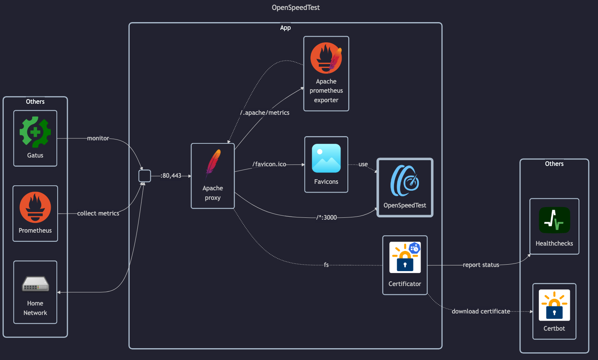

# OpenSpeedTest

## Docs

- Docs: `https://openspeedtest.com` <!-- website down -->
- Installation guide: `https://openspeedtest.com/selfhosted-speedtest` <!-- website down -->
- GitHub: <https://github.com/openspeedtest/Speed-Test>
- GitHub: <https://github.com/openspeedtest/Docker-Image>
- DockerHub: <https://hub.docker.com/r/openspeedtest/latest>

## Before initial installation

- Follow general [guide](../../docs/Checklist%20for%20new%20docker-apps.md)

## After initial installation

Empty
