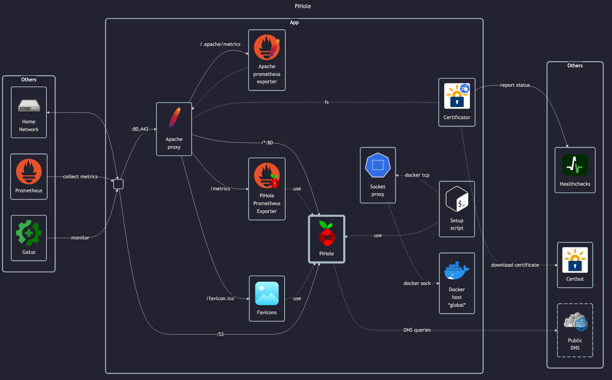

# Pi-hole

## Docs

- Docs: <https://docs.pi-hole.net>
- GitHub: <https://github.com/pi-hole/docker-pi-hole>
- DockerHub: <https://hub.docker.com/r/pihole/pihole>
- FTL Configuration: <https://docs.pi-hole.net/ftldns/configfile>

If proxy will cause issues, see: <https://www.reddit.com/r/pihole/comments/tttp7j/pihole_with_nginx_reverse_proxy_redirection_to>

The setup script is inspired by: <https://www.devwithimagination.com/2021/01/05/how-i-configure-pi-hole-without-the-ui>

## Before initial installation

- \[All\] Create base secrets
- \[Prod\] Add healthchecks monitor for `certificate-manager` and configure `HOMELAB_HEALTHCHECK_URL`

## After initial installation

Empty
