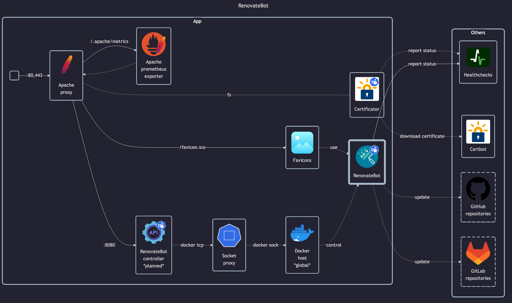

# RenovateBot

- Docs: <https://docs.renovatebot.com>
- GitHub: <https://github.com/renovatebot/renovate>
- DockerHub: <https://hub.docker.com/r/renovate/renovate>

## Before initial installation

- \[All\] Create base secrets
- \[Prod\] Configure GitHub/GitLab access tokens
- \[Prod\] Add healthchecks monitor for `app` and configure `HOMELAB_HEALTHCHECK_URL`

## After initial installation

Empty
