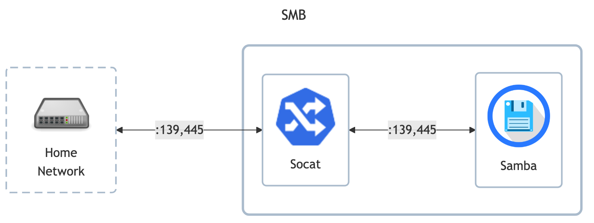

# SMB

- Samba setup tutorial: <https://wiki.samba.org/index.php/Setting_up_Samba_as_a_Standalone_Server>
- `smb.conf` manpage: <https://www.samba.org/samba/docs/current/man-html/smb.conf.5.html>

## Before initial installation

- \[All\] Create base secrets

## After initial installation

- \[Prod\] Setup `smb` Ping IP monitor
- \[Prod\] Setup `smb` TCP monitor for all open ports
