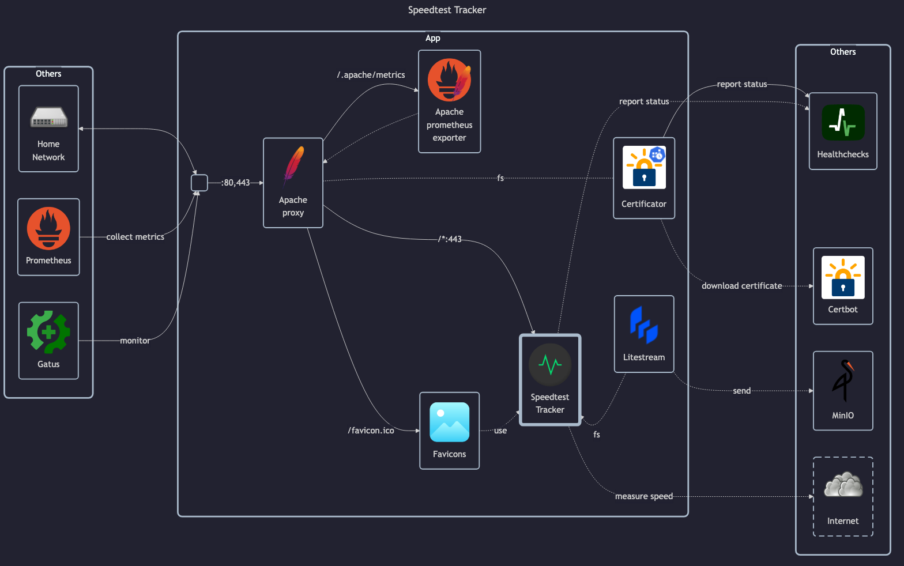

# SpeedTest Tracker

- Main page: <https://speedtest-tracker.dev>
- Docs: <https://docs.speedtest-tracker.dev>
- GitHub: <https://github.com/alexjustesen/speedtest-tracker>

---

- LinuxServer docs: <https://docs.linuxserver.io/images/docker-speedtest-tracker/>
- LinuxServer GitHub: <https://github.com/linuxserver/docker-speedtest-tracker>
- LinuxServer DockerHub: <https://hub.docker.com/r/linuxserver/speedtest-tracker>

## Before initial installation

- \[All\] Create base secrets
- \[Prod\] Add healthchecks monitor and configure `HOMELAB_HEALTHCHECK_URL` for:
    - `certificate-manager.env`

## After initial installation

- Change admin credentials (defaults are `admin@example.com`/`password`)
