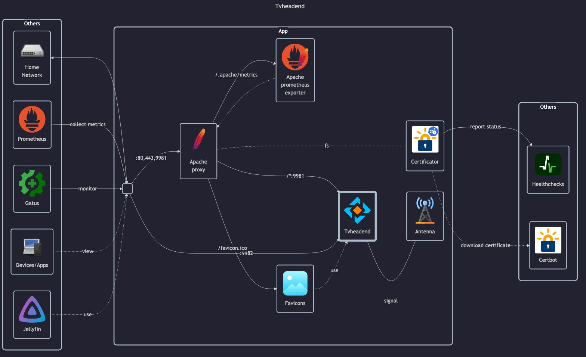

# Tvheadend

- Official docs: <https://docs.tvheadend.org/documentation>
- Linuxserver docks: <https://docs.linuxserver.io/images/docker-tvheadend>
- DockerHub: <https://hub.docker.com/r/linuxserver/tvheadend>

## Before initial installation

- \[All\] Create base secrets
- \[Prod\] Add healthchecks monitor and configure `HOMELAB_HEALTHCHECK_URL` for:
    - `certificate-manager.env`

## After initial installation

- \[Prod\] Setup `uptime-kuma` HTTP/HTTPS monitor
- \[Prod\] Setup Tvheadend:
    - Finish "setup wizard" according to <https://docs.linuxserver.io/images/docker-tvheadend/#application-setup>, TL;DR: goto `Configuration > General > Base > Start Wizard`
