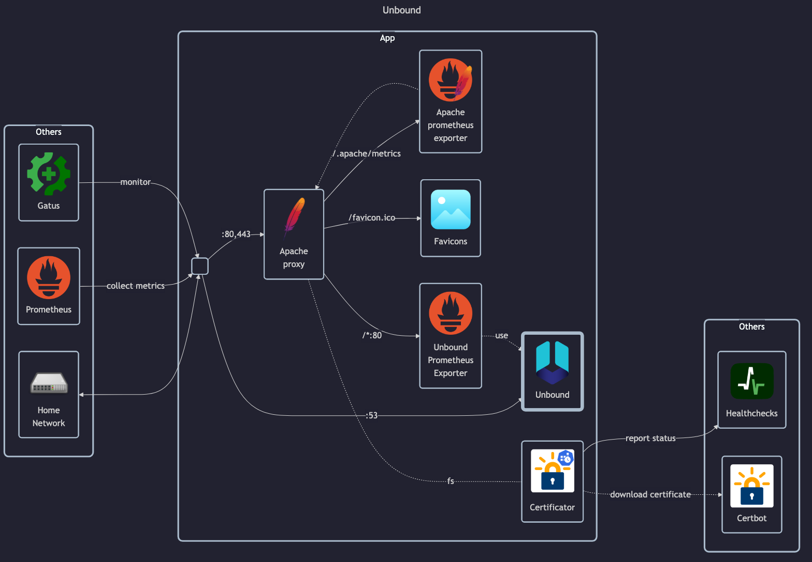

# Unbound

## Docs

Unbound:

- Docs: <https://unbound.docs.nlnetlabs.nl>
- GitHub: <https://github.com/NLnetLabs/unbound>

Prometheus exporter:

- GitHub: <https://github.com/letsencrypt/unbound_exporter>

## Before initial installation

- \[All\] Create base secrets
- \[Prod\] Add healthchecks monitor for `certificate-manager` and configure `HOMELAB_HEALTHCHECK_URL`

## After initial installation

Empty
