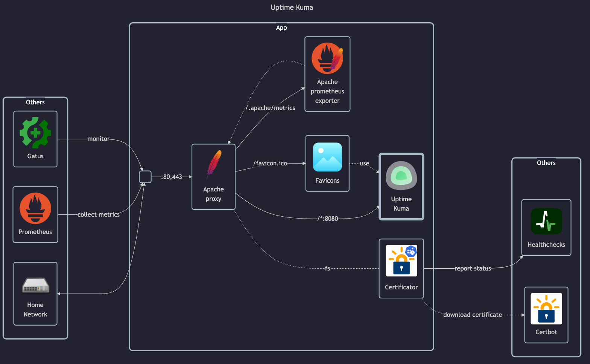

# Uptime Kuma

- GitHub: <https://github.com/louislam/uptime-kuma>
- DockerHub: <https://hub.docker.com/r/louislam/uptime-kuma>
- Docs: <https://github.com/louislam/uptime-kuma/wiki>

## Before initial installation

- \[All\] Create base secrets
- \[Prod\] Add healthchecks monitor for `certificate-manager` and configure `HOMELAB_HEALTHCHECK_URL`

## After initial installation

- \[All\] Setup admin _username_ and _password_
- \[Prod\] Settings setup:
    - Setup timezone
    - Setup Primary Base URL
    - Disallow automatic updates
    - Setup Email notifications (SMTP)
    - Modify statistics history persistant interval
- \[Prod\] Setup self monitoring:
    - IP (ping) monitor
    - TCP monitor for all open ports
    - HTTP/HTTPS monitor
    - TBD: HTTPS JSON query monitor for basic API operation?
