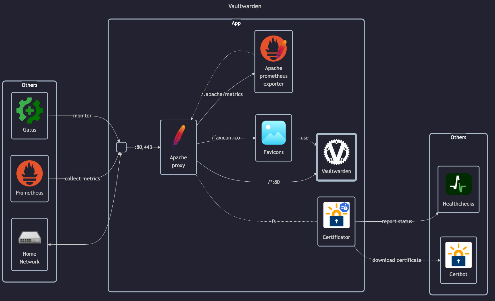

# Vaultwarden

## Docs

- GitHub: <https://github.com/dani-garcia/vaultwarden>
- DockerHub: <https://hub.docker.com/r/vaultwarden/server>
- Install tutorial: <https://community.hetzner.com/tutorials/how-to-set-up-vaultwarden>

Bitwarden:

- Docs: <https://bitwarden.com/help>

## Before initial installation

- \[All\] Create base secrets
- \[Prod\] Add healthchecks monitor for `certificate-manager` and configure `HOMELAB_HEALTHCHECK_URL`

## After initial installation

- \[Prod\] Setup folders for all homelab services, and in each folder setup all secrets for each service
