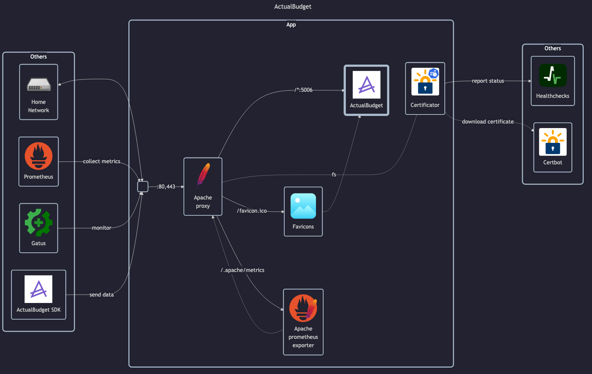

# ActualBudget

## Docs

- Homepage: <https://actualbudget.org>
- GitHub: <https://github.com/actualbudget/actual>
- DockerHub: <https://hub.docker.com/r/actualbudget/actual-server>
- Install guide: <https://actualbudget.org/docs/install/docker>

## Before initial installation

- Follow general [guide](../../docs/Checklist%20for%20new%20docker-apps.md)

## After initial installation

- Setup main password
- Change display date, start day of week
- Enable end-to-end encryption and copy key to Vaultwarden
- Copy SyncID to Vaultwarden
