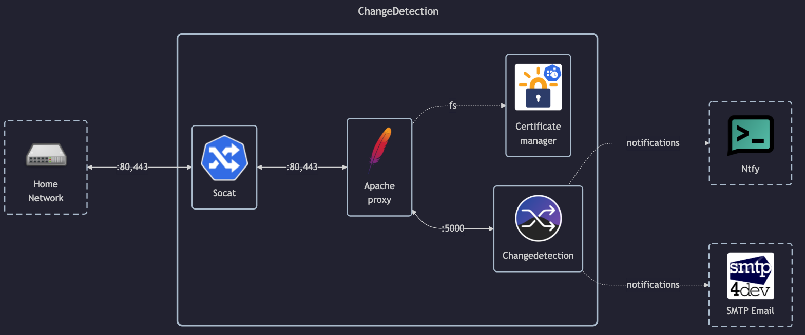

# Changedetection

## Docs

Changedetection:

- GitHub: <https://github.com/dgtlmoon/changedetection.io>
- DockerHub: <https://hub.docker.com/r/dgtlmoon/changedetection.io>
- Homepage: <https://changedetection.io>

SockPuppetBrowser (used for opening \[web\] sites):

- GitHub: <https://github.com/dgtlmoon/sockpuppetbrowser>
- DockerHub: <https://hub.docker.com/r/dgtlmoon/sockpuppetbrowser>

## Before initial installation

- Follow general [guide](../../docs/Checklist%20for%20new%20docker-apps.md)

## After initial installation

- Setup admin password in `/settings#general`
- Setup notifications (ntfy, mail):
    - ntfy: see [ntfy/README.md](../ntfy/README.md)
    - mail: `smtp4dev.matejhome.com`
- Tweak settings:
    - Scrape interval (6 hours)
    - Use `sockpuppetbrowser` for fetching
    - Do not open "History" in new tabs
