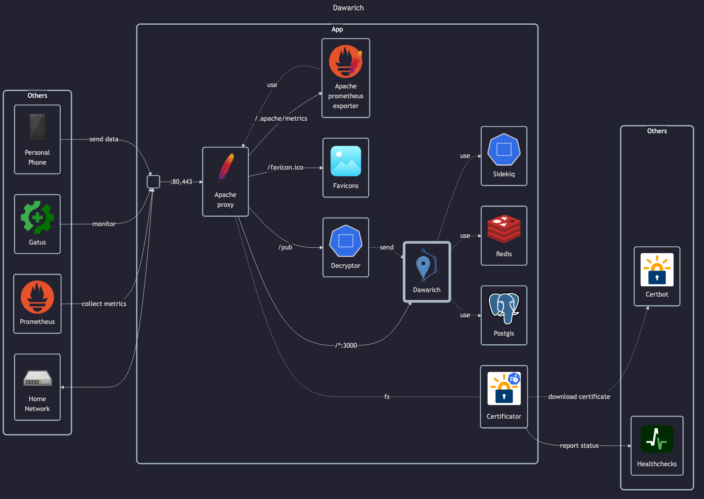

# Dawarich

## Docs

- GitHub: <https://github.com/Freika/dawarich>
- DockerHub: <https://hub.docker.com/r/freikin/dawarich>
- Docs: <https://dawarich.app/docs/intro>

## Before initial installation

- Follow general [guide](../../docs/Checklist%20for%20new%20docker-apps.md)

## After initial installation

- Change credentials - defaults: `demo@dawarich.app:password`
