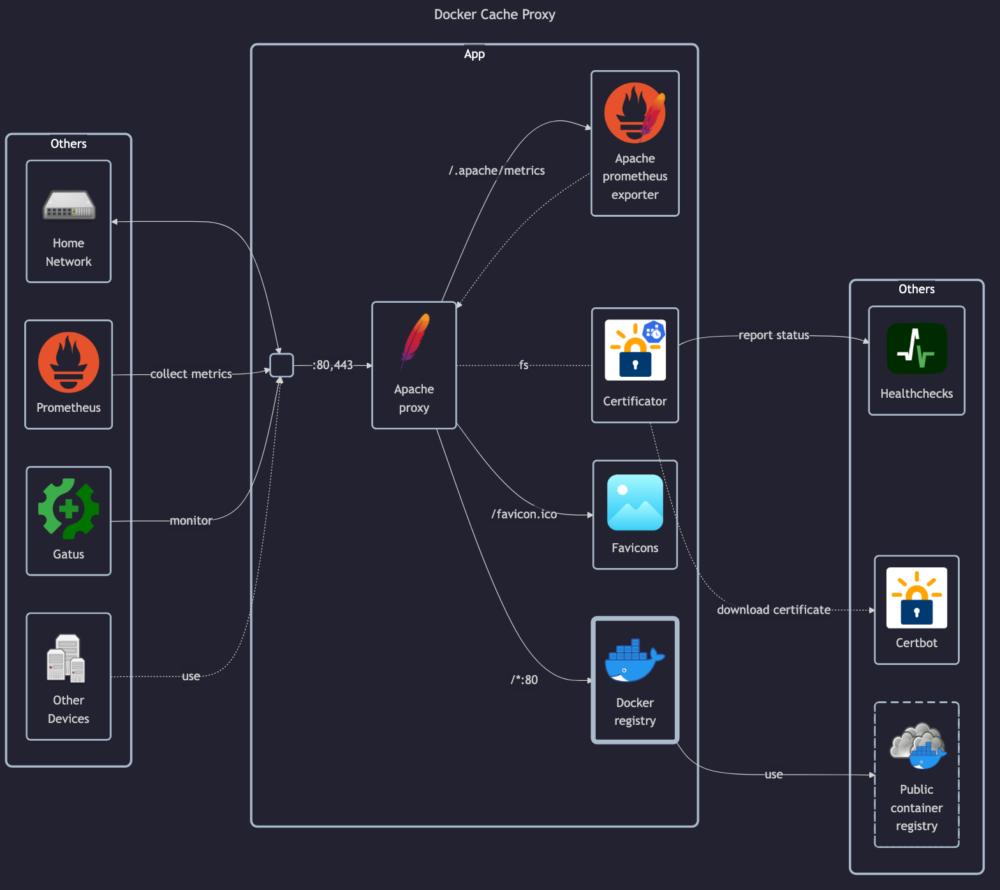

# Docker cache proxy



## Docs

- Documentation: <https://docs.docker.com/docker-hub/mirror>
- DockerHub: <https://hub.docker.com/_/registry>
- Docker registry install guide: <https://distribution.github.io/distribution/about/deploying>

Generic resources:

- Config file format: <https://distribution.github.io/distribution/about/configuration>
- <!-- textlint-disable -->
  Docker registry API: <https://distribution.github.io/distribution/spec/api>
  <!-- textlint-enable -->
- Tutorial for using multiple mirrors (client-side): <https://blog.alexellis.io/how-to-configure-multiple-docker-registry-mirrors>
- Relevant blogpost: <https://ranchergovernment.com/blog/mitigate-the-docker-dilemma-with-a-proxy-cache>
- <!-- textlint-disable -->
  Docker proxy general API: <https://distribution.github.io/distribution/spec/api>
  <!-- textlint-enable -->
- DockerHub mirroring docs: <https://docs.docker.com/docker-hub/mirror/#run-a-registry-as-a-pull-through-cache>

## Before initial installation

- Follow general [guide](../../docs/Checklist%20for%20new%20docker-apps.md)
    - Optionally set `REGISTRY_PROXY_USERNAME` and `REGISTRY_PROXY_PASSWORD` in `app.env` for authenticated mirror

## After initial installation

- Configure Docker mirroring in Docker clients according to
  <https://blog.alexellis.io/how-to-configure-multiple-docker-registry-mirrors>, chapter "A single registry" (*example below)

*The following Docker config (replace `example.com` with your target IP/domain):

```json
{
  ...
  "registry-mirrors": [
    "https://example.com"
  ]
}
```

## Other Notes

For this purpose I also considered:

### Third-party Docker registry proxy

- GitHub: <https://github.com/rpardini/docker-registry-proxy>

This one looks unmaintained (last commit 2 years ago)

## Third-party oci-registry

- GitHub: <https://github.com/mcronce/oci-registry>
- Discussion: <https://www.reddit.com/r/selfhosted/comments/yn3do0/ociregistry_a_lightweight_container_registry>

### Sonatype Nexus3

- GitHub: <https://github.com/sonatype/docker-nexus3>
- DockerHub: <https://hub.docker.com/r/sonatype/nexus3>
- Setup Tutorial: <https://mtijhof.wordpress.com/2018/07/23/using-nexus-oss-as-a-proxy-cache-for-docker-images>
- Official docs: <https://help.sonatype.com/en/sonatype-nexus-repository.html>

It has a couple pros and cons:

- Pros:
    - Can proxy docker, and other types of content
    - Can add/remove proxies and artifactories in UI on demand
    - Supports automatic cleanup schedules
    - Can remove artifacts (images, layers) in the admin UI
- Cons:
    - Clunky initial setup (must setup admin credentials interactively)
    - Must configure proxies post-install interactively, no configuration as code
    - Consumes a lot of CPU and RAM (when doing nothing consumes 20% CPU and 200MB of RAM)
