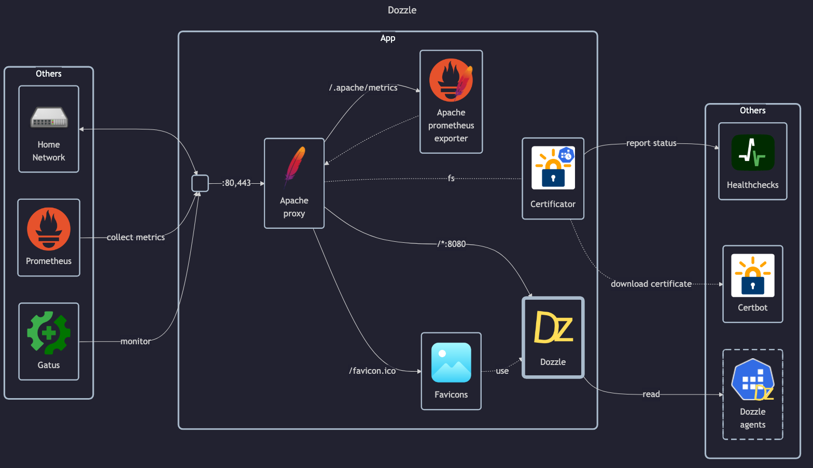

# Dozzle server

## Docs

- Main page: <https://dozzle.dev>
- Docs: <https://dozzle.dev/guide/what-is-dozzle>
    - Getting started: <https://dozzle.dev/guide/getting-started>
    - Healthcheck: <https://dozzle.dev/guide/healthcheck>
    - Agent mode: <https://dozzle.dev/guide/agent>
    - Authentication: <https://dozzle.dev/guide/authentication>
- GitHub: <https://github.com/amir20/dozzle>
- DockerHub: <https://hub.docker.com/r/amir20/dozzle>

## Before initial installation

- Follow general [guide](../../docs/Checklist%20for%20new%20docker-apps.md)

## After initial installation

Empty
