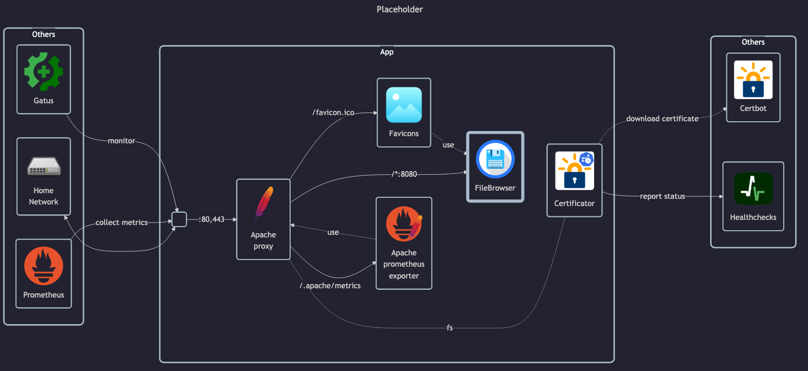

# FileBrowser

## Docs

- Homepage: <https://filebrowser.org>
- Docs: <https://filebrowser.org/installation.html>
- GitHub: <https://github.com/filebrowser/filebrowser>
- DockerHub: <https://hub.docker.com/r/filebrowser/filebrowser>

## Before initial installation

- Follow general [guide](../../docs/Checklist%20for%20new%20docker-apps.md)

## After initial installation

- Login and change admin's _username_ (matej) and _password_ (custom)
    - Default username is `admin` and initial password is randomly generated and displayed in container logs
- Add other users (monika, homelab-test, homelab-viewer)
