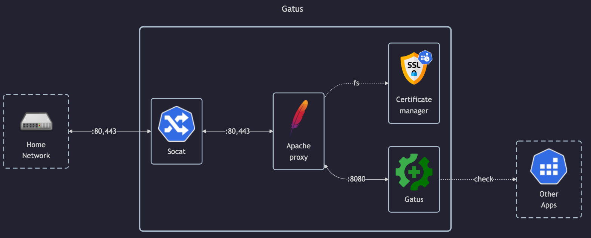

# Gatus

## Docs

- <!-- textlint-disable -->
  GitHub: <https://github.com/TwiN/gatus?tab=readme-ov-file#docker>
  <!-- textlint-enable -->
- DockerHub: <https://hub.docker.com/r/twinproduction/gatus>

## Before initial installation

- Follow general [guide](../../docs/Checklist%20for%20new%20docker-apps.md)

## After initial installation

Empty
