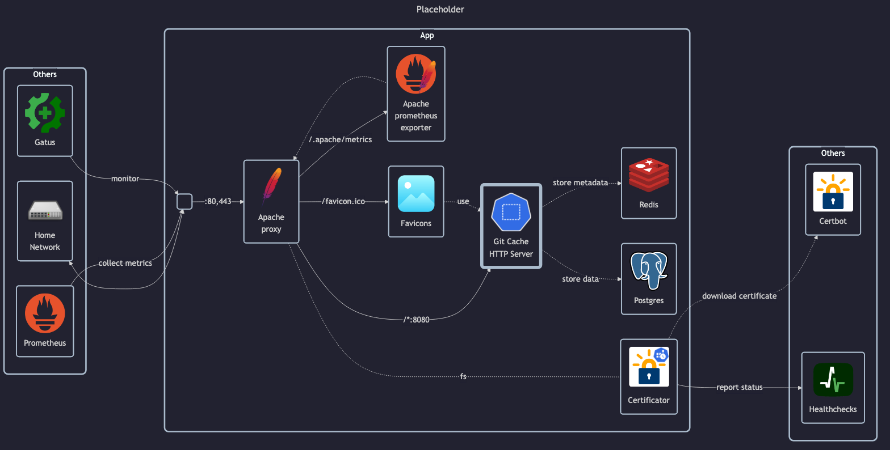

# Git Cache

## Docs

This server inspired by this blogpost: <https://info.varnish-software.com/blog/speeding-up-git-with-http-caching>.
However I couldn't get Varnish or other off-the-shelf Git caching proxies to work correctly.
So I've written this custom git-cache, which fulfills my requirements.

Other considered off-the-shelf projects were:

- <https://github.com/varnishcache/varnish-cache>
    - Don't remember the exact reasons, but couldn't get it to work properly
- <https://github.com/jonasmalacofilho/git-cache-http-server>
    - Don't remember the exact reasons, but couldn't get it to work properly
- <https://gitlab.wikimedia.org/mhurd/git-cache-proxy>
    - Don't remember the exact reasons, but couldn't get it to work properly
- <https://kooltux.github.io/git-cache/>
    - Disregarded, because it requires modifying the client, but it may be revisited in the future.

## Before initial installation

- Follow general [guide](../../docs/Checklist%20for%20new%20docker-apps.md)

## After initial installation

Empty
