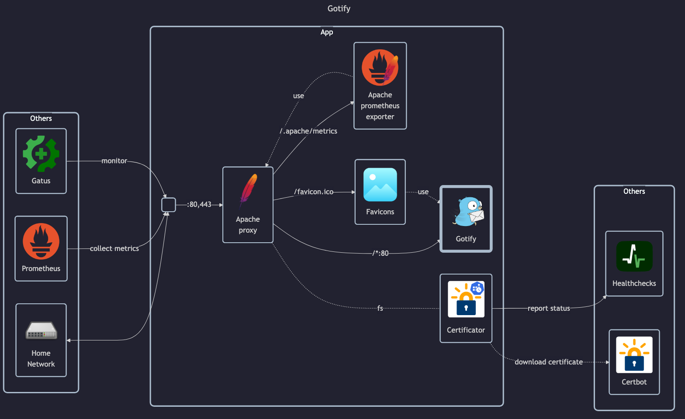

# Gotify



## Docs

Gotify server:

- Homepage: <https://gotify.net>
- Docs: <https://gotify.net/docs/index>
    - Installation: <https://gotify.net/docs/install>
    - Configuration: <https://gotify.net/docs/config>
- GitHub: <https://github.com/gotify/server>
- DockerHub: <https://hub.docker.com/r/gotify/server>

## Before initial installation

- Follow general [guide](../../docs/Checklist%20for%20new%20docker-apps.md)

## After initial installation

- Change access tokens in all affected apps
    - Tokens for: _Gatus_ in `secrets.yml`
    - URLs for: _ChangeDetection_, _Healthchecks_, _UptimeKuma_ - `gotifys://gotify.matejhome.com/{token}`


## Publishing notifications

For publishing notifications to gotify (see also: ):

```txt
gotifys://gotify.matejhome.com/{token}
```
