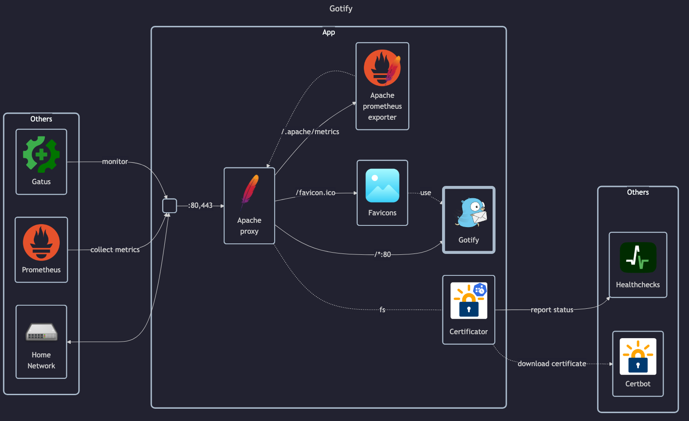

# Gotify



## Docs

Gotify server:

- Homepage: <https://gotify.net>
- Docs: <https://gotify.net/docs/index>
    - Installation: <https://gotify.net/docs/install>
    - Configuration: <https://gotify.net/docs/config>
- DockerHub: <https://hub.docker.com/r/gotify/server>

## Before initial installation

- Follow general [guide](../../docs/Checklist%20for%20new%20docker-apps.md)

## After initial installation

- Create apps for receiving notifications:
    - _Changedetection_, _Gatus_, _Healthchecks_, _UptimeKuma_
    - Save _Gatus_ token in _Vaultwarden_
- Create `homelab-viewer` and `homelab-test` users

## Publishing notifications

For publishing notifications to gotify (see also: <https://gotify.net/docs/pushmsg>):

```txt
gotifys://gotify.matejhome.com/{token}
```
