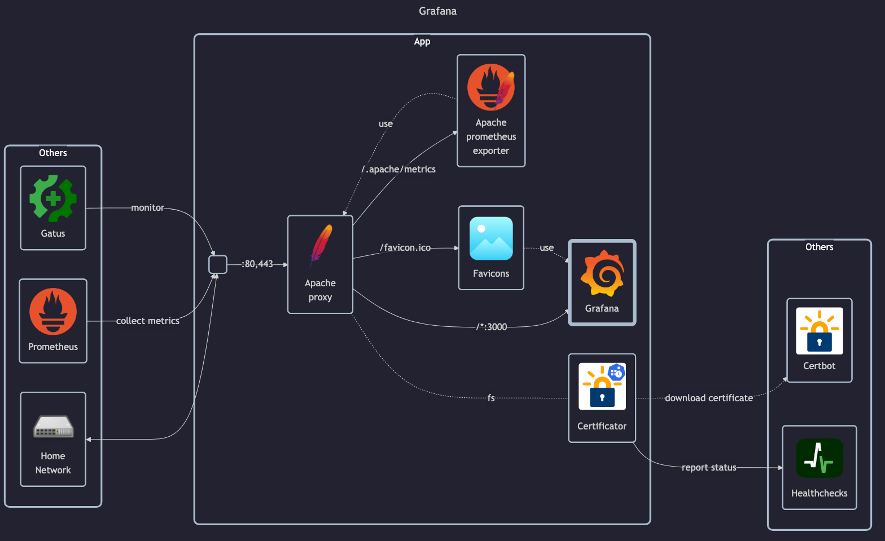

# Grafana

## Docs

- DockerHub: <https://hub.docker.com/r/grafana/grafana>
- GitHub: <https://github.com/grafana/grafana>
- Docs: <https://grafana.com/docs>
    - ENV config: <https://grafana.com/docs/grafana/latest/setup-grafana/configure-grafana>

## Before initial installation

- Follow general [guide](../../docs/Checklist%20for%20new%20docker-apps.md)

## After initial installation

Empty
