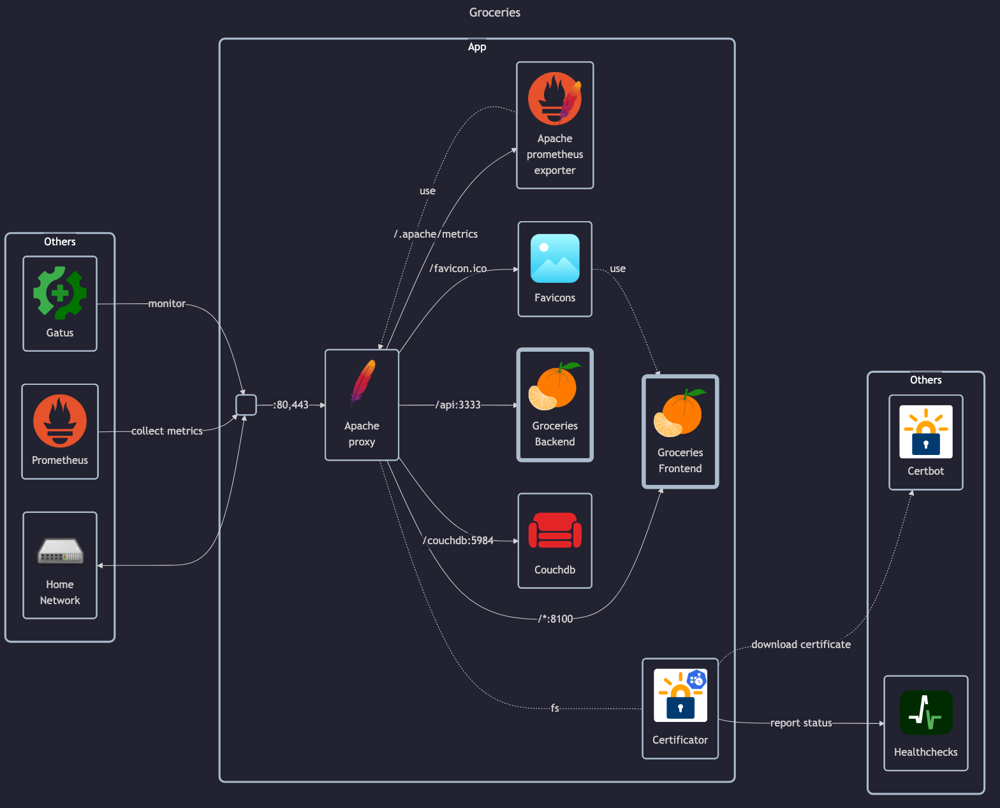

# Groceries

## Docs

- Docs: <https://davideshay.github.io/groceries>
    - Docker install guide: <https://davideshay.github.io/groceries/installation/docker-setup>
- Posts:
    - <https://www.reddit.com/r/selfhosted/comments/12c84km/selfhosted_grocery_shopping_app>
    - <https://www.reddit.com/r/selfhosted/comments/14p754g/groceries_is_now_specifically_clementines>
- GitHub: <https://github.com/davideshay/groceries>

Backend:

- GHCR registry: <https://github.com/davideshay/groceries/pkgs/container/groceries-server>

Frontend:

- GHCR registry: <https://github.com/davideshay/groceries/pkgs/container/groceries-client>

## Before initial installation

- Follow general [guide](../../docs/Checklist%20for%20new%20docker-apps.md)

## After initial installation

- Temporarily set `DISABLE_ACCOUNT_CREATION=0` and create user accounts (matej, monika, test)
- Create shared list between `matej` and `monika`
- Create categories and shopping items
