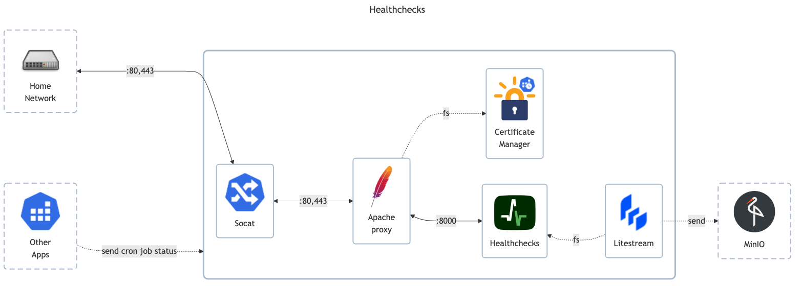

# Healthchecks.io

## Docs

- GitHub: <https://github.com/healthchecks/healthchecks>
- DockerHub: <https://hub.docker.com/r/healthchecks/healthchecks>
- Docs - General: <https://healthchecks.io/docs/self_hosted_docker>
- Docs - Server configuration: <https://healthchecks.io/docs/self_hosted_configuration>
- Docs - Running in Docker: <https://healthchecks.io/docs/self_hosted_docker>

## Before initial installation

- Follow general [guide](../../docs/Checklist%20for%20new%20docker-apps.md)

## After initial installation

- \[Prod\] Temporarily turn on registrations and create admin account
- \[Prod\] Configure notifications: ntfy / gotify / smtp
    - `https://ntfy.matejhome.com` + topic + access-token
    - `https://gotify.matejhome.com` + token
    - `system@healthchecks.matejhome.com`
- \[Prod\] Add notifications to _All_ group
- \[Prod\] Generate api-key / api-key (readonly) / ping-key and save it in Vaultwarden
- \[Prod\] Run script to create all healthchecks
