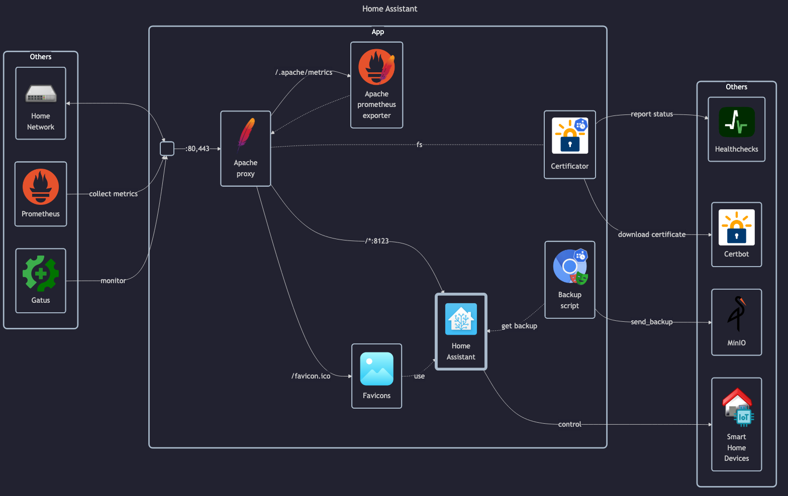

# Home Assistant

## Docs

- Generic installation tutorial: <https://www.home-assistant.io/installation>
- Container installation tutorial: <https://www.home-assistant.io/installation/linux#install-home-assistant-container>
- Configuration guide: <https://www.home-assistant.io/docs/configuration>
- Official DockerHub: <https://hub.docker.com/r/homeassistant/home-assistant>

---

Note: LinuxServer unused

- LinuxServer docs: <https://docs.linuxserver.io/images/docker-homeassistant>
- LinuxServer GitHub: <https://github.com/linuxserver/docker-homeassistant>
- LinuxServer DockerHub: <https://hub.docker.com/r/linuxserver/homeassistant>

## Before initial installation

- Follow general [guide](../../docs/Checklist%20for%20new%20docker-apps.md)

## After initial installation

- \[Prod\] Finish initial setup and create `admin` user
- \[Prod\] Configure basic settings
- \[Prod\] Create admin users: `automation`
- \[Prod\] Create non-admin users: `matej`, `monika`, `test`
- \[Prod\] Setup access token for `automation`
- \[Prod\] Optional: Setup 2FA - <https://www.home-assistant.io/docs/authentication/multi-factor-auth>
- \[Prod\] Connect smart devices
