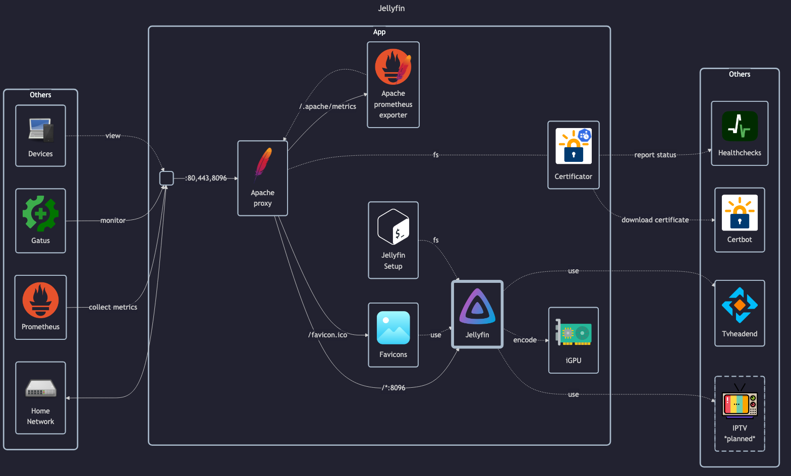

# Jellyfin

## Docs

Jellyfin (official):

- Jellyfin docs: <https://jellyfin.org/docs/general/quick-start>
- Jellyfin Hardware Acceleration docs: <https://jellyfin.org/docs/general/post-install/transcoding/hardware-acceleration> and <https://jellyfin.org/docs/general/post-install/transcoding/hardware-acceleration/intel>

LinuxServer (unofficial):

- LinuxServer docs: <https://docs.linuxserver.io/images/docker-jellyfin>
- LinuxServer GitHub: <https://github.com/linuxserver/docker-jellyfin>
- LinuxServer DockerHub: <https://hub.docker.com/r/linuxserver/jellyfin>

## Before initial installation

- Follow general [guide](../../docs/Checklist%20for%20new%20docker-apps.md)

## After initial installation

- Complete initial setup wizard with `matej`
    - Create `monika` and `test` users
    - Disable remote connections
- Customize settings (eg. ) (location: Settings -> Administration -> General)
    - Disable "Quick Connect"
    - Verify "Server Name"
    - Create Access token for `Homelab`
    - Change cache path to `/cache`
- Connect to Tvheadend
    - Install Tvheadend plugin (location: Settings -> Administration -> Plugins -> Catalog)
    - Restart Jellyfin (location: Settings -> Dashboard)
    - Configure Tvheadend plugin details (location: Settings -> Administration -> Plugins -> My Plugins -> Tvheadend)
        - Tvheadend address, credentials `stream`
        - Enable "Hide Tvheadend Recordings channel"
    - Refresh Guide Data (location: Settings -> Administration -> Live TV)
- Enable Hardware Acceleration:
    - This requires the host system to support it - additional system packages required, follow Jellyfin HWA docs to install them <https://jellyfin.org/docs/general/post-install/transcoding/hardware-acceleration/intel/#low-power-encoding>
        - `sudo apt-get install --yes firmware-linux-nonfree intel-gpu-tools vainfo`
    - Then enable Hardware Acceleration in settings accordingly (location: Settings -> Administration -> Playback):
        - Enable HWA via VAAPI
        - Enable all supported codecs for decoding (depends on current machine CPU/GPU)
        - Also enable encoding in HEVC
        - Enable low power encoding
        - Limit encoding threads to 1 (this is enough when HWA is enabled, even for multiple streams, and plays nicely with other things running on the host machine)
        - In summary, all the settings from this screenshot (taken on Odroid H3): 

NOTE: Some clients may require unchecking "Prefer fMP4-HLS Media Container" for each user/client,
because it is stored on the client-side in browser `localStorage` (location: Settings -> Playback).
