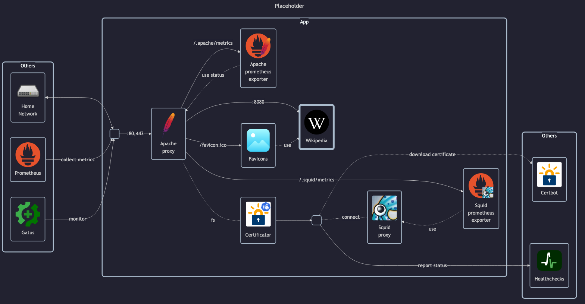

# Wikipedia

## Docs

Kiwix:

- Homepage: <https://kiwix.org>
- GitHub: <https://github.com/kiwix/kiwix-tools>
- GHCR registry: <https://github.com/kiwix/kiwix-tools/pkgs/container/kiwix-serve>
- Kiwix archives: <https://download.kiwix.org/zim>
    - Wikipedia: <https://download.kiwix.org/zim/wikipedia>
    - Wiktionary: <https://download.kiwix.org/zim/wiktionary/>

## Before initial installation

- Follow general [guide](../../docs/Checklist%20for%20new%20docker-apps.md)

## After initial installation

Empty
