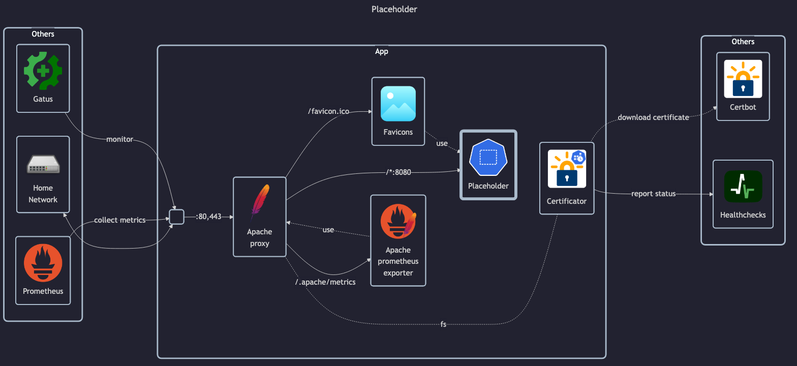

# Libretranslate

## Docs

- Homepage: <https://libretranslate.com>
- Docs: <https://docs.libretranslate.com>
  - Install guide: <https://docs.libretranslate.com/guides/installation>
- GitHub: <https://github.com/LibreTranslate/LibreTranslate>
- DockerHub: <https://hub.docker.com/r/libretranslate/libretranslate>

## Before initial installation

- Follow general [guide](../../docs/Checklist%20for%20new%20docker-apps.md)

## After initial installation

N/A
