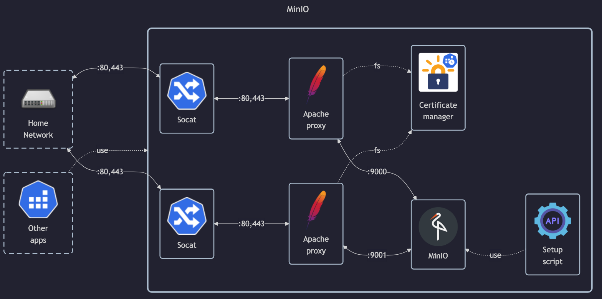

# MinIO

## Docs

General (Server):

- DockerHub: <https://hub.docker.com/r/minio/minio>
- Install guide: <https://min.io/docs/minio/linux/operations/install-deploy-manage/deploy-minio-single-node-single-drive.html>
- Container guide: <https://min.io/docs/minio/container/index.html>
- Reverse proxy guide: <https://min.io/docs/minio/linux/integrations/setup-nginx-proxy-with-minio.html>
- Monitoring with prometheus: <https://min.io/docs/minio/linux/operations/monitoring/collect-minio-metrics-using-prometheus.html>

Client:

- GitHub: <https://github.com/minio/mc>
- Docs: <https://min.io/docs/minio/linux/reference/minio-mc.html>
- DockerHub: <https://hub.docker.com/r/minio/mc> (unused)

## Before initial installation

- Follow general [guide](../../docs/Checklist%20for%20new%20docker-apps.md)

## After initial installation

- Create prometheus token with local CLI and save in Vaultwarden:
    - `mc alias set homelab https://minio.matejhome.com`
    - `mc admin prometheus generate homelab`
