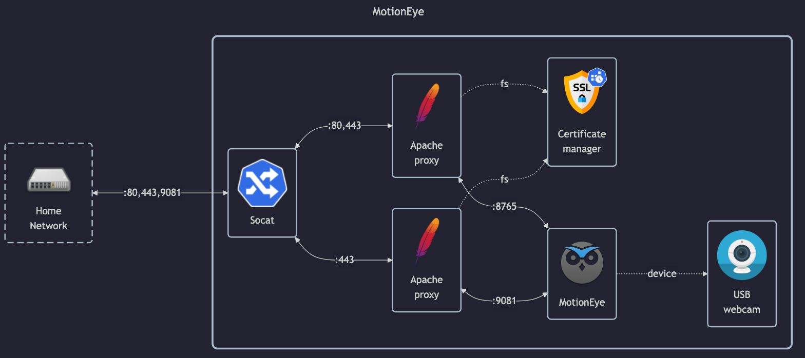

# MotionEye

## Docs

Motion:

- Homepage: <https://motion-project.github.io>
- GitHub: <https://github.com/Motion-Project/motion>

MotionEye:

- GitHub: <https://github.com/motioneye-project/motioneye>
    - WiKi: <https://github.com/motioneye-project/motioneye/wiki>
    - Install guide: <https://github.com/motioneye-project/motioneye/wiki/Install-In-Docker#build-instructions>
- GHCR registry: <https://github.com/motioneye-project/motioneye/pkgs/container/motioneye>
- HomeAssistant plugin: <https://www.home-assistant.io/integrations/motioneye>

Notes:

- Streaming only works in `stream`, not in `admin`.

## Before initial installation

- Follow general [guide](../../docs/Checklist%20for%20new%20docker-apps.md)

## After initial installation

- Setup `admin` and `homelab-stream` user passwords
    - By default there are no passwords
- Setup camera
    - Add camera according to 
    - Setup blacked out zone
