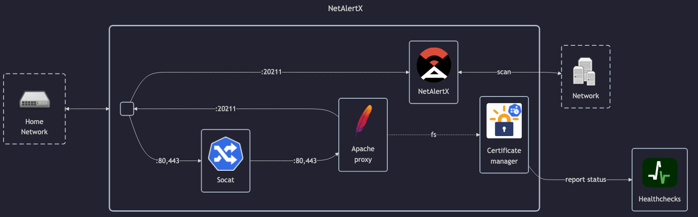

# NetAlertX

## Docs

- Docs: <https://github.com/jokob-sk/NetAlertX/tree/main/docs>
    - Docker install guide: <https://docs.netalertx.com/DOCKER_INSTALLATION>
- GitHub: <https://github.com/jokob-sk/NetAlertX>
- DockerHub: <https://registry.hub.docker.com/r/jokobsk/netalertx>

## Before initial installation

- Follow general [guide](../../docs/Checklist%20for%20new%20docker-apps.md)

## After initial installation

N/A
