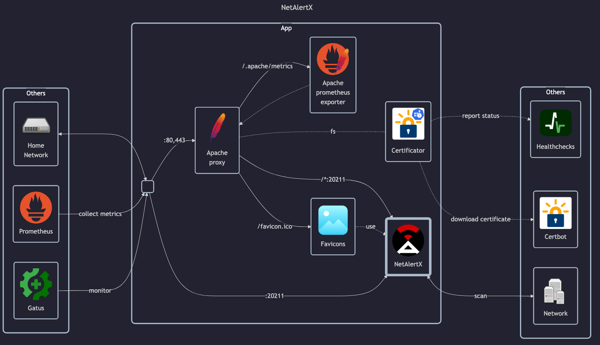

# NetAlertX

## Docs

- GitHub: <https://github.com/jokob-sk/NetAlertX>
- Docs: <https://github.com/jokob-sk/NetAlertX/tree/main/docs>
    - Docker install guide: <https://github.com/jokob-sk/NetAlertX/blob/main/dockerfiles/README.md>
- DockerHub: <https://registry.hub.docker.com/r/jokobsk/netalertx>

## Before initial installation

- Follow general [guide](../../docs/Checklist%20for%20new%20docker-apps.md)

## After initial installation

Empty
