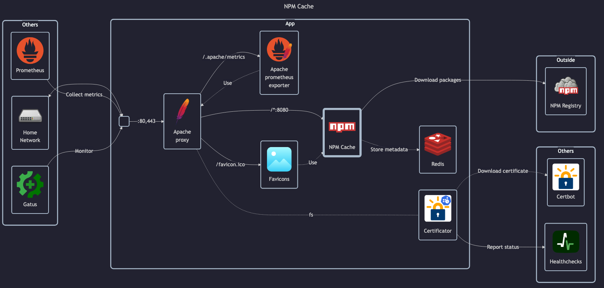

# NPM Cache

## Docs

- GitHub: <https://github.com/stackdumper/npm-cache-proxy>
- DockerHub: <https://hub.docker.com/r/pkgems/npm-cache-proxy>

## Before initial installation

- Follow general [guide](../../docs/Checklist%20for%20new%20docker-apps.md)

## After initial installation

Empty
