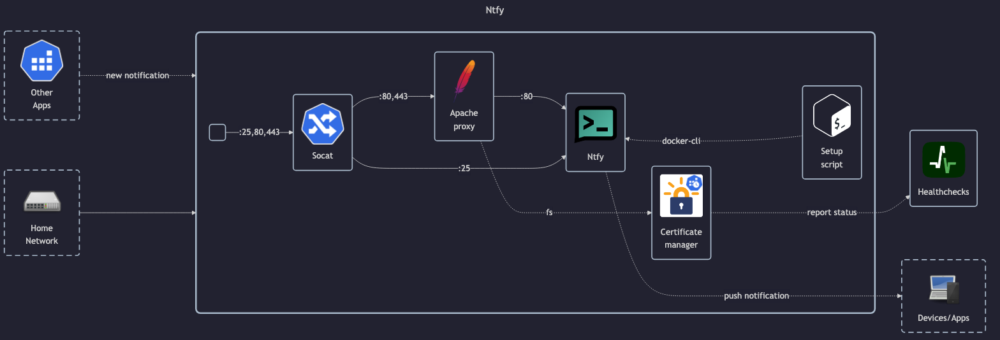

# Ntfy



## Docs

- GitHub: <https://github.com/binwiederhier/ntfy>
- DockerHub: <https://hub.docker.com/r/binwiederhier/ntfy>
- Docs: <https://docs.ntfy.sh>
- Install guide: <https://docs.ntfy.sh/install>
- Install guide - Docker: <https://docs.ntfy.sh/install/#docker>

## Before initial installation

- Follow general [guide](../../docs/Checklist%20for%20new%20docker-apps.md)

## After initial installation

- Configure basic settings
- Read publisher token and save it in Vaultwarden:
    - `docker exec -it ntfy-app /bin/sh -c 'ntfy token list publisher'`

## Publishing notifications

For publishing notifications to ntfy (see also: <https://github.com/caronc/apprise/wiki/Notify_ntfy>):

```txt
ntfy://<token>@ntfy.matejhome.com/<topic>
```

Alternatively you can also publish via email (see also <https://github.com/caronc/apprise/wiki/Notify_email>):

```txt
mailto://ntfy-<topic>+<token>@ntfy.matejhome.com
```

Obviously replace `<token>` and `<topic>` with their respective values (remove enclosing `<>`).
