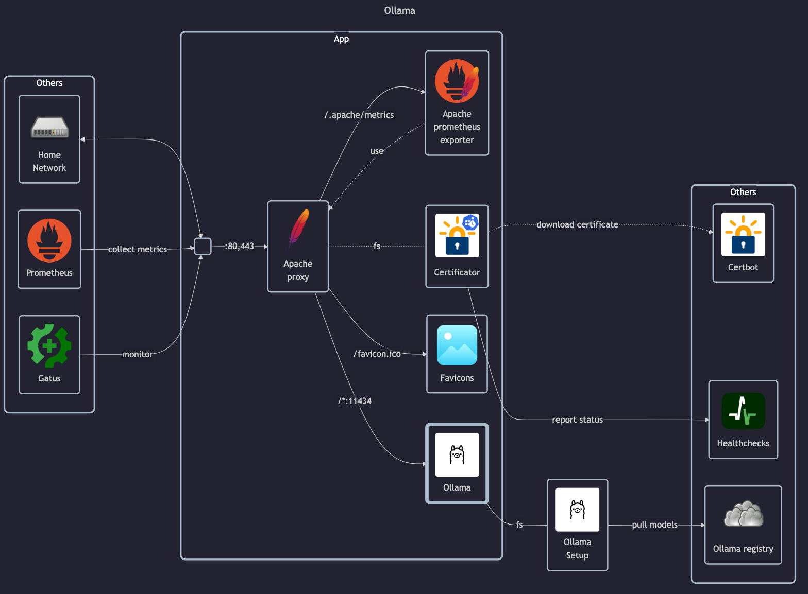

# Ollama



## Docs

- Docs:
    - Install instructions: <https://ollama.com/blog/ollama-is-now-available-as-an-official-docker-image>
    - Models: <https://ollama.com/search>
- DockerHub: <https://hub.docker.com/r/ollama/ollama>

## Before initial installation

- Follow general [guide](../../docs/Checklist%20for%20new%20docker-apps.md)

## After initial installation

- Download models:

```sh
docker run --rm --interactive --tty --entrypoint /bin/sh --volume "$PWD/app-data/ollama/data:/home/homelab/.ollama:rw" ollama-app -c '(ollama serve &) && sleep 10 && ollama pull <model>'
# Replace <model> with eg. deepseek-r1:1.5b
```
