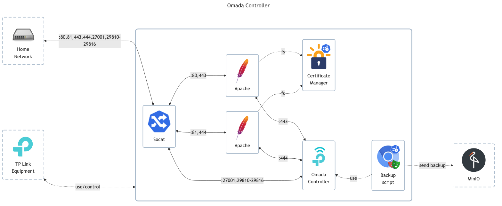

# TP-Link Omada SDN Controller

## Docs

- GitHub: <https://github.com/mbentley/docker-omada-controller>
- DockerHub: <https://hub.docker.com/r/mbentley/omada-controller>

## Before initial installation

- Follow general [guide](../../docs/Checklist%20for%20new%20docker-apps.md)

## After initial installation

- \[All\] Setup admin _username_, _password_ and _email_
- \[All\] Setup initial settings + initial login to finish the wizard
- \[Prod\] Create extra users: `viewer`
- \[Prod\] Configure basic settings
    - General config and settings customization
    - Setup SMTP server address for emails
    - Send automatic backups via SFTP
    - Send logs to remote syslog server
