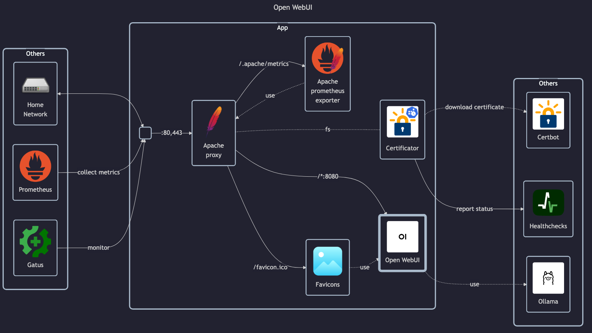

# Template

## Docs

- Homepage: <https://openwebui.com>
- GitHub: <https://github.com/open-webui/open-webui>
- Docs: <https://docs.openwebui.com>

## Before initial installation

- Follow general [guide](../../docs/Checklist%20for%20new%20docker-apps.md)

## After initial installation

- Create admin account `matej@matejhome.com`
- Create user accounts: `homelab-viewer@homelab.matejhome.com`
