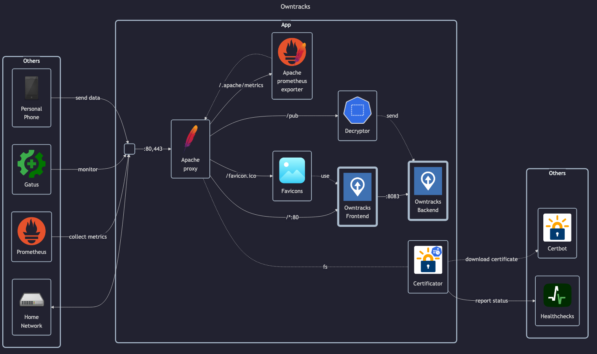

# Owntracks

## Docs

- DockerHub: <https://hub.docker.com/u/owntracks>
    - Frontend: <https://hub.docker.com/r/owntracks/frontend>
    - Backend: <https://hub.docker.com/r/owntracks/recorder>
- GitHub: <https://github.com/owntracks>
    - Frontend: <https://github.com/owntracks/frontend>
    - Backend: <https://github.com/owntracks/recorder>
- Docs: <https://owntracks.org/booklet>
- Setup guide: <https://bhdouglass.com/blog/self-hosted-device-tracking-with-owntracks>

## Before initial installation

- Follow general [guide](../../docs/Checklist%20for%20new%20docker-apps.md)

## After initial installation

Empty
