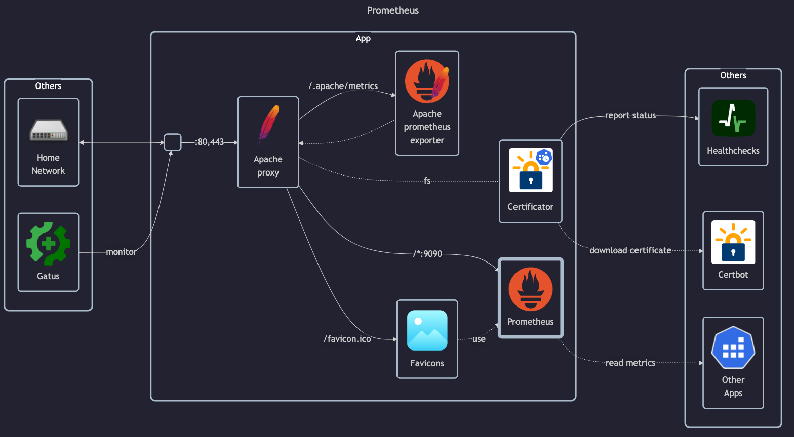

# Prometheus

## Docs

PiHole:

- Docs: <https://prometheus.io/docs/introduction/overview>
    - Installation: <https://prometheus.io/docs/prometheus/latest/installation>
    - Configuration: <https://prometheus.io/docs/prometheus/latest/configuration/configuration>
- GitHub: <https://github.com/prometheus/prometheus>
- DockerHub: <https://hub.docker.com/r/prom/prometheus>

## Before initial installation

- Follow general [guide](../../docs/Checklist%20for%20new%20docker-apps.md)

## After initial installation

Empty
