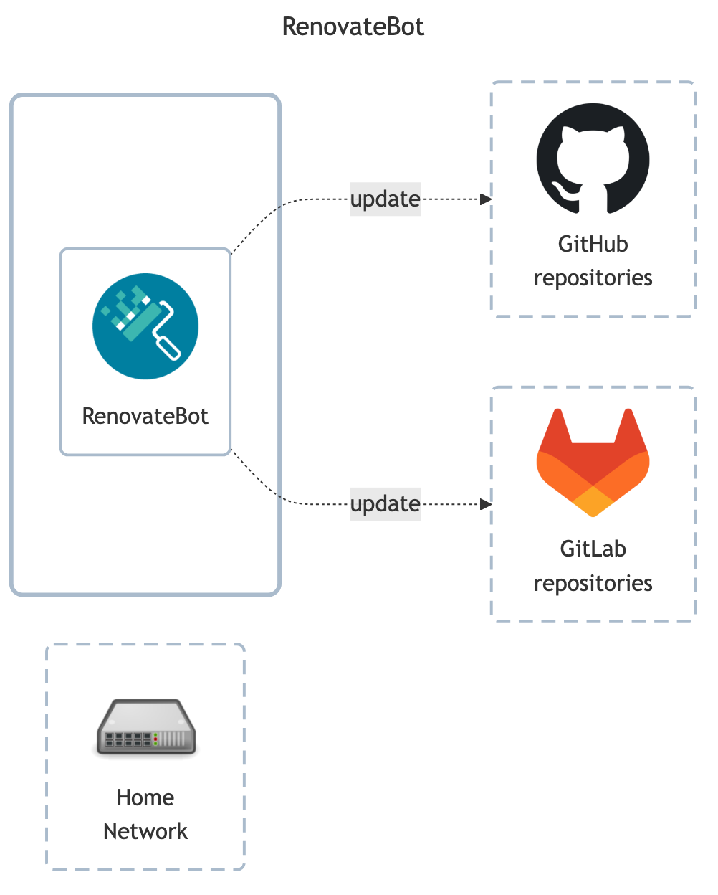

# RenovateBot

## Docs

- GitHub: <https://github.com/renovatebot/renovate>
- DockerHub: <https://hub.docker.com/r/renovate/renovate>
- Docs: <https://docs.renovatebot.com>
    - Self hosted examples: <https://docs.renovatebot.com/examples/self-hosting>
    - Self hosted config docs: <https://docs.renovatebot.com/self-hosted-configuration>
    - Running guide: <https://github.com/renovatebot/renovate/blob/main/docs/usage/getting-started/running.md>

## Before initial installation

- Follow general [guide](../../docs/Checklist%20for%20new%20docker-apps.md)
- \[Prod\] Configure access tokens
    - `RENOVATEBOT_TOKEN` is token for your specific Git host - GitHub/GitLab/...
    - `GITHUB_COM_TOKEN` is for `github.com` - It is _required_ even if targeting other Git hosts, such as `gitlab`.
      For more see subsection <https://github.com/renovatebot/renovate/blob/main/docs/usage/getting-started/running.md#githubcom-token-for-changelogs>.
      This should be a readonly token with access to public repositories and packages.

## After initial installation

Empty
