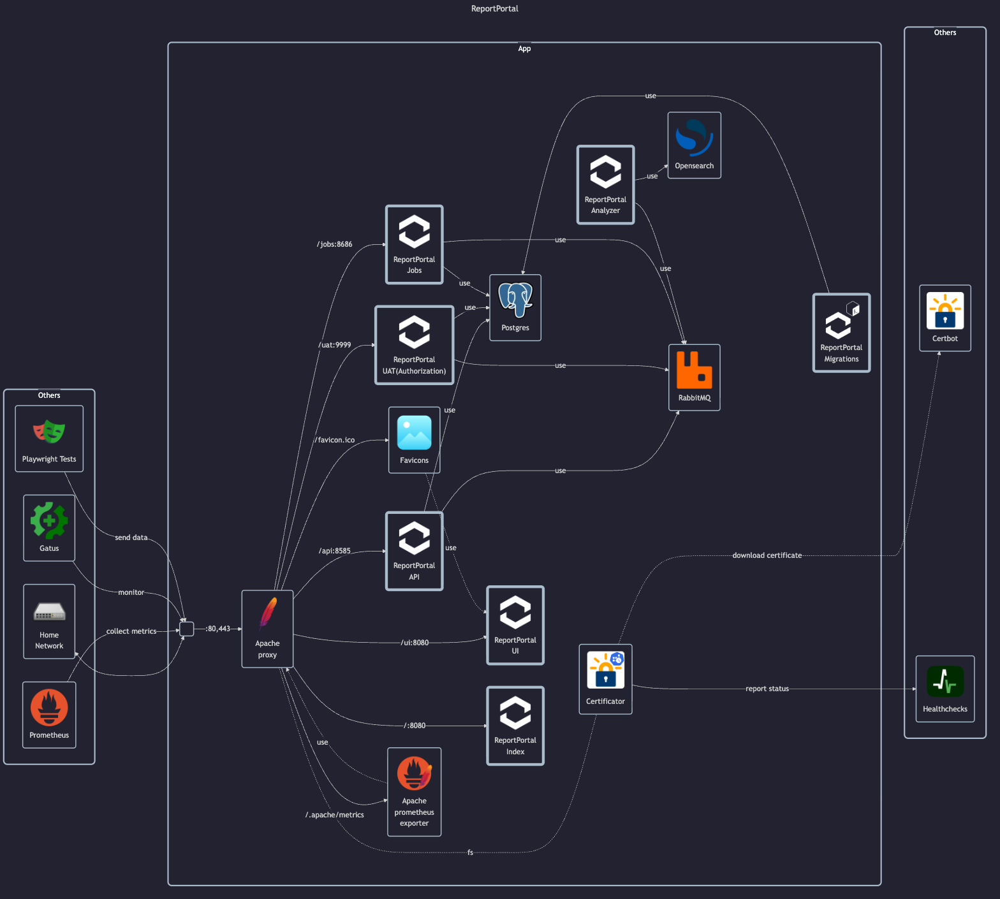

# ReportPortal

## Docs

- Homepage: <https://reportportal.io>
- Docs:
    - Install guide: <https://reportportal.io/installation>
- GitHub: <https://github.com/reportportal/reportportal>
- DockerHub: <https://hub.docker.com/u/reportportal>

Subservices:

- Postgres:
    - Database service used by ReportPortal
    - Stores metadata and user/test results
    - Volume is used for persistent storage
- RabbitMQ:
    - Asynchronous message broker for inter-service communication
    - Provides queues used in analysis and background jobs
    - Includes optional plugins for dashboard, LDAP, shovel, etc.
- Opensearch:
    - Search and analytics engine for the analyzer stack
    - Used to store and query indexed test logs
    - Runs in single-node mode with web security disabled
- ReportPortal Migrations:
    - Applies DB schema migrations before services start
    - Runs once on container start and exits
    - Requires database to be healthy
- ReportPortal Index:
    - Service for indexing test data and logs
    - Listens for incoming test results and logs
    - Exposed via Traefik on root `/`
- ReportPortal UI:
    - Web-based frontend for ReportPortal
    - Provides the visual interface for test reports
    - Routed via Traefik under path `/ui`
- ReportPortal API:
    - ReportPortal backend API service
    - Hosts core business logic and background processing
    - Requires database, RabbitMQ, and gateway to be available
    - Exposes a REST API and internal job coordination endpoints
    - Routed via Traefik under path `/api`
- ReportPortal UAT:
    - Authorization and authentication service
    - Manages login, session lifecycle, and token issuance
    - Initializes admin password on first deployment via env variable
    - Routed via Traefik under path `/uat`
- ReportPortal Jobs:
    - Scheduled job processor for ReportPortal
    - Executes cleanup, notification, and cron-based background tasks
    - Uses AMQP and DB to manage lifecycle of stored data and plugins
    - Routed via Traefik under `/jobs`
- ReportPortal Analyzer (optional):
    - Automatic test result analyzer, auto-analysis and ML training
    - Performs log analysis and pattern detection
    - Relies on OpenSearch and RabbitMQ
    - Writes persistent data to shared volume

## Before initial installation

- Follow general [guide](../../docs/Checklist%20for%20new%20docker-apps.md)

## After initial installation

- Note: Default user: `superadmin`
- Invite user `matej`
